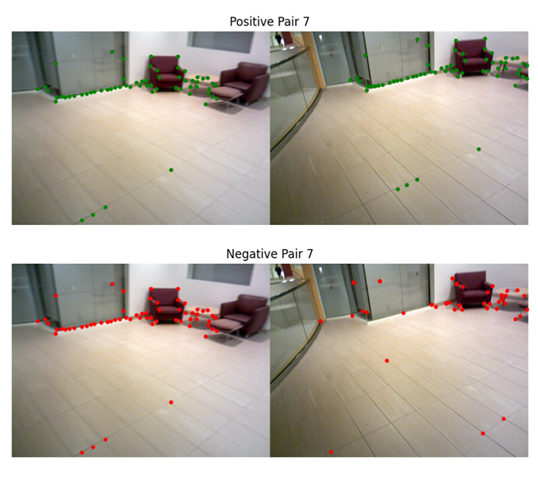
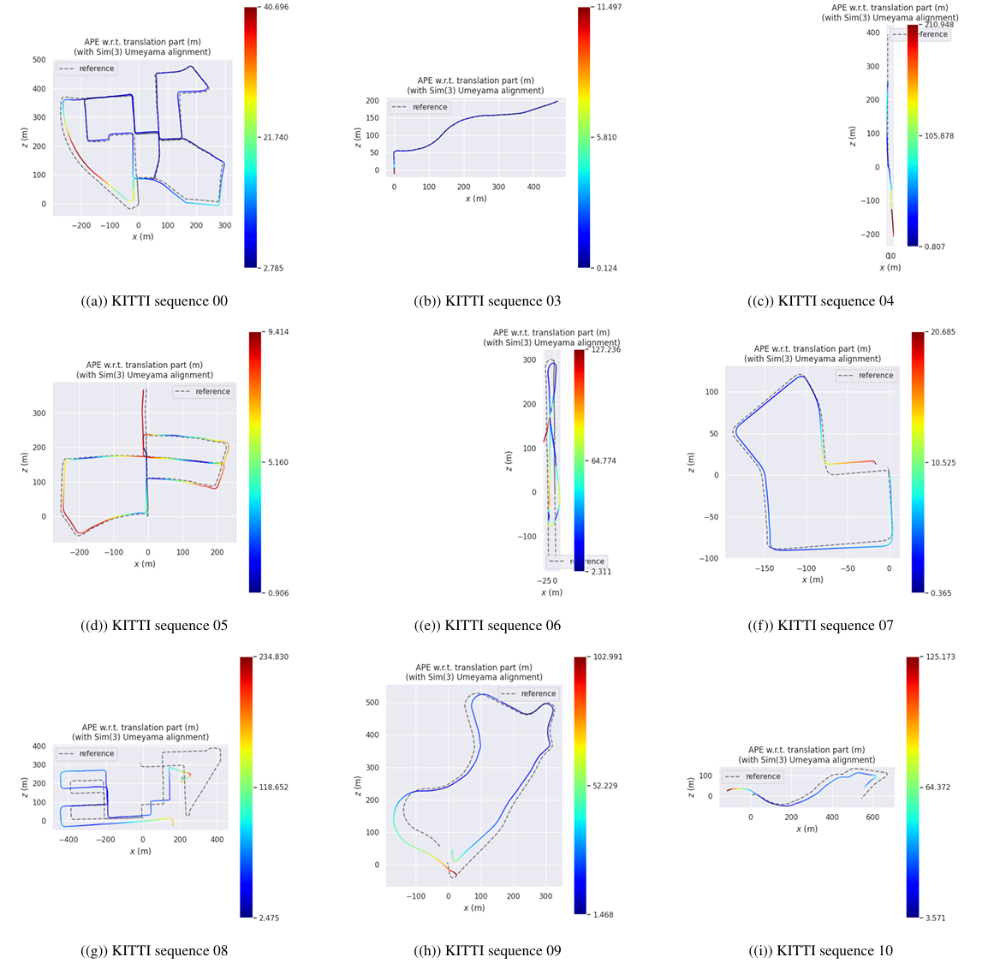

# Learning-based-Feature-for-VSLAM
Learning based method of feature point extraction for Visual SLAM.

  

Our work covers the entire process from training dataset construction, model design and training, to integrating the model into a downstream task, which is a popular visual SLAM framework, and validating the model’s performance.

 We followed the GCNv2-SLAM paper, implementing data preprocessing and using geometric constraints to construct training samples as described in the paper, making the training data publicly accessible in the future. 
 

  

 We designed and implemented the network structure based on the paper’s descriptions and made timely adjustments to the network structure and loss functions based on issues encountered during experiments. 
 
 By integrating the model into a visual SLAM system during the inference phase, we validated the training effectiveness using the downstream task and adjusted the SLAM framework to better suit our approach. 

 

  

 
 This resulted in a complete model training framework, including a series of tools and a real-time capable visual SLAM system. 
 
 Based on the issues and insights discovered in training sample construction, network structure, and integration with the SLAM system, future work includes adopting more stable and accurate methods for constructing training sample pairs, modifying the network structure to better suit this task, adjusting the SLAM framework and heuristic parameters to fit learning-based keypoint extraction methods, or exploring potential ways to enhance visual SLAM performance considering hardware advancements, trending of commercial solutions, and developments in computer vision models.

We discovered some inconsistencies in the GCNv2-SLAM paper during the actual implementation process. For instance, the paper mentions the use of straight-through estimators to binarize the descriptor in the CNN model. However, the margin value for the descriptor loss suggests that a binarization layer was not used in the network structure. This conclusion was further confirmed by analyzing the torchscript code in the PyTorch
 model files provided in their GitHub repository.
